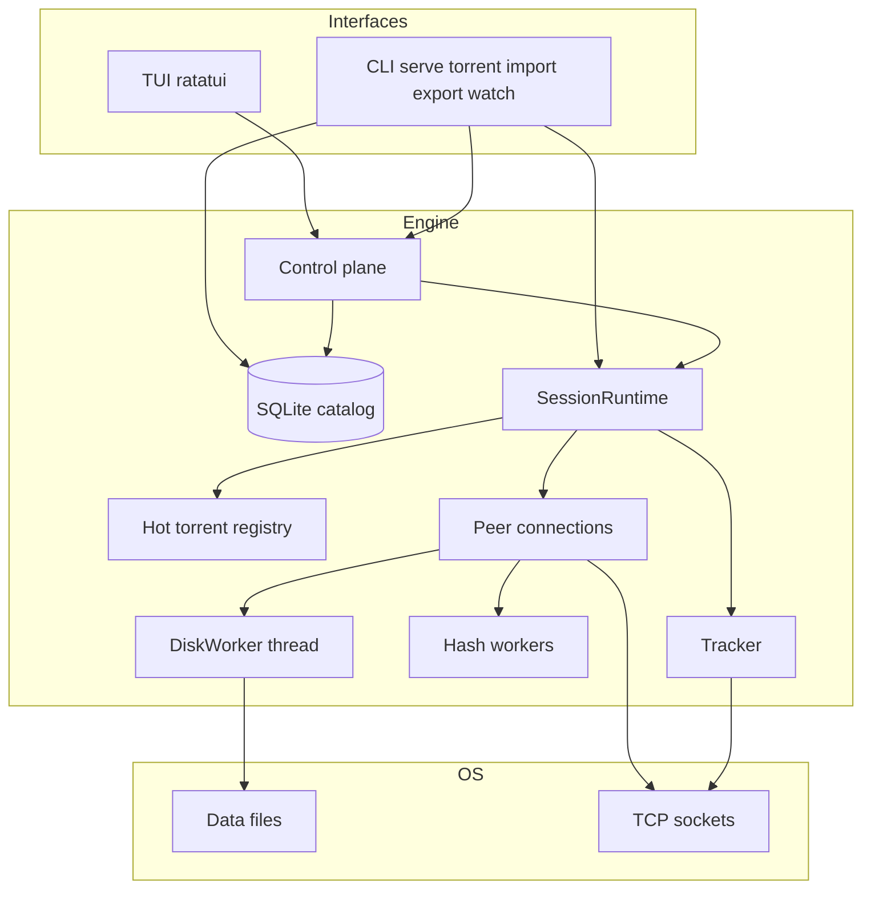

# Design: seedchamp

| | |
|--|--|
| **Name** | **seedchamp** |
| **Language** | Rust |
| **UI** | Terminal (ratatui + crossterm) |
| **Catalog** | SQLite |
| **Process** | Single binary |
| **Platforms** | Linux + FreeBSD + Darwin (macOS) |
| **Modules** | [domains.md](domains.md) |
| **Open work** | [roadmap.md](roadmap.md) |
| **PE** | `off` / `prefer-plain` (default) / `prefer-rc4` / `require-rc4` |
| **Wire identity** | peer id `-sc0001-`; UA `seedchamp/<major>`; LTEP `seedchamp <major>` (overridable) |

---

## 1. Overview

seedchamp is a BitTorrent client for large libraries. The catalog is SQLite. Only a hot set holds wire state. Verified payload lives on disk.

1. **SQLite** holds torrents, files, bitfields, stats, peer caches, and settings.
2. **Wire state** is per connection. Idle torrents do not hold dense per-piece tables.
3. **Disk** is the payload authority. Seed fill uses **`[upload].backend`**. Leech writes go through **`DiskWorker`** after SHA-1. Platform ladders: [domains.md](domains.md).
4. **Import / export** moves torrents between the catalog and rtorrent or Transmission session trees.
5. **TUI and CLI** share one `SessionRuntime`. Active incomplete torrents always seed what they have.

**Out of scope:** WebUI, plugins, Windows parity, PEX, DHT. Trackers and optional manual peers only. Magnet / ut_metadata: [roadmap.md](roadmap.md).

Module map: [domains.md](domains.md). Schema: [`schema.sql`](../crates/engine/src/catalog/schema.sql).

---

## 2. Goals

| Goal | Note |
|------|------|
| Scale | 1k–10k torrents in library; RAM scales with hot set |
| Seed | Accept peers on started torrents without densifying all |
| Leech | Pipelining, endgame, multi-peer, verify-before-write |
| Ratio | Seed-while-leech when active; always unchoke |
| Latency | TUI from snapshots; no peer I/O on the UI thread |
| Safety | No partial corrupt piece on disk |
| Import / export | rtorrent and Transmission session trees |
| Crypto | MSE/PE + RC4 |
| Upload | `[upload].backend` — [domains.md](domains.md) |

---

## 3. Architecture

**Interfaces:** TUI (default) and CLI (`serve`, `torrent …`, `import|export rtorrent|transmission`, `watch`, …) both drive one engine. Module boundaries: [domains.md](domains.md).



### Thread topology

```text
TUI (UI thread)  →  Control plane  →  accept (seedchamp-acc)  →  least-peers → N peer workers (seedchamp-io)
                         ↓                      │
                    SQLite / Hot                ├─► tracker (seedchamp-trk)
                                                ├─► N hash workers (seedchamp-hash-*)
                                                └─► DiskWorker (io_uring / AIO / thread pwrite)
```

| Component | Model | Responsibility |
|-----------|--------|----------------|
| **Main / TUI** | UI thread | Draw and input only; never blocks on disk, peer I/O, or announce |
| **Control plane** | Control + mutate + catalog **reader** threads | Command bus; SQLite writer on mutate; RO list SQL on reader; hot-set policy — no per-peer wire loops |
| **Accept** | 1 OS thread (`seedchamp-acc`) | Listen socket; hand off to least-loaded peer worker; tick / bootstrap |
| **Tracker** | 1 OS thread (`seedchamp-trk`) | HTTP(S) (cyper + hickory) and UDP announce |
| **Peer I/O** | N OS threads (default CPU count; `seedchamp-io`) | Peer sessions pinned after least-peers; task per connection, not thread per connection |
| **Hash** | N OS threads (`seedchamp-hash-*`) | Piece SHA-1 only; successful pieces go to DiskWorker |
| **Disk** | `DiskWorker` thread | Verified leech piece writes (io_uring / AIO / pwrite) |

**Process rules:**

- TUI talks to the control plane only (no peer sockets or SQLite across network waits on the UI thread).
- SQLite: single writer (mutate path); WAL readers (including catalog reader for the TUI list).
- Peer tasks do not hold a SQLite write lock across network I/O.
- Disk and hash stay off the peer I/O threads; completions hop via channels.
- `serve` and `bench swarm` use the same `SessionRuntime` stack as the TUI.

**Async I/O:** engine networking is **Compio** (accept, peer duplex, tracker). Platform upload/disk backends: [domains.md](domains.md).

---

## 4. Data Model (SQLite)

**Schema:** [`crates/engine/src/catalog/schema.sql`](../crates/engine/src/catalog/schema.sql) (applied and migrated by the engine).

### Design principles

- **Normalized catalog** + **blob columns** for large sparse structures (bitfields, piece hashes, metainfo).
- Bitfield: store as BLOB; complete torrents may omit dense bits when `complete=1`.
- **Soft-delete:** `deleted` / `deleted_at` hide rows from lists; payload on disk is never removed by delete paths. Catalog-only purge after `catalog.soft_delete_purge_days` (default 30; `0` = never). Soft-delete: TUI **Ctrl-D** or CLI `torrent del`. **Hard remove:** TUI **`:remove`** drops catalog rows only (CASCADE); still keeps payload files. Both require the torrent stopped (`want_start = 0`).
- **Activation:** `want_start` is the user flag for active swarm membership.

### Hot vs cold (runtime)

| Always cold (DB only) | Hot when needed |
|----------------------|-----------------|
| Name, paths, sizes, trackers | Peer connections + bitfield copy |
| Piece hashes (`SELECT` → `Vec<u8>`) | Leech staging pieces |
| Peer cache | Active unchoke set |
| Aggregate stats | Open FDs / io_uring slots |

**Activate (hot):** `start` / `sync_want_start` loads the torrent into `HotRegistry`.  
**Deactivate:** `stop` removes it and flushes stats. Recheck and inbound peers do not load a cold torrent. There is no idle-peer eviction.

---

## 5. Protocol engine

### BEPs / behaviors

- BEP 3 core (handshake, bitfield, request/piece/cancel, choke/unchoke, interested)
- MSE/PE + RC4 on all post-handshake wire bytes when selected
- BEP 10 extension protocol
- BEP 6 Fast (Have All/None, Reject Request, Allowed Fast). Suggest recv is honored in the picker; we do not send Suggest.
- Multi-tracker (BEP 12)
- Compact peer lists

PEX and DHT are out of scope. Magnet / ut_metadata: see [roadmap.md](roadmap.md).

### Peer session

```text
PeerSession {
  conn: TcpStream,
  remote_bitfield: BitField,      // only while connected
  download_queue / upload_queue,
  encryption: Plain | Rc4 { enc, dec },
  rates
}
```

### Wire crypto

| Mode | Upload | Download |
|------|--------|----------|
| Plain | `[upload].backend` ladder | blocks → staging |
| RC4 | fill → encrypt → write | decrypt → staging |

```toml
# network.encryption
# off | prefer-plain (default) | prefer-rc4 | require-rc4
encryption = "prefer-plain"
```

### Leech path

```text
peers → (decrypt if RC4) → block assembler (per piece) → staging RAM
      → SHA-1 OK → Disk write whole piece (io_uring/pwrite)
      → mark bitfield + SQLite journal batch
      → HAVE to peers
```

**Pipeline knobs:** per-peer request depth is **BDP-sized** from an EMA of that peer’s wire download rate (`desired ≈ 5s × rate / 16 KiB`). Config: `swarm.pipeline` = initial depth; `swarm.pipeline_max` = cap. PIECE uses the same `read_buf` parse path as other BT messages. Request stall (20 s, 4 s in endgame) Cancels and re-Requests; a partial frame stays in the buffer. Only ingested blocks refresh the stall clock.

**Staging RAM:** shared **per-torrent** freelist of piece-sized buffers, budgeted by **`swarm.staging_mem_limit`** (default **256 MiB**; TOML `"256M"` / `"1G"` or integer bytes). Cap `N = limit / piece_length`; buffers are **lazy-allocated** on first acquire and recycled on release (no free/realloc thrash). Peers acquire/release under exclusive piece claim. A peer may assemble at most enough pieces to fill its request pipeline, at most `⌈N/16⌉` of the freelist, and at most **2** pieces when `piece_length ≥ 4 MiB` (a 1 GiB pool / 16 MiB pieces stays ~32 peers, not a handful). `try_start` failure releases the exclusive claim (do not lock a piece with no buffer). **Hash/disk does not keep the staging slot** — `take_for_hash` detaches the buffer so writes (disk depth 32 × 16 MiB) cannot empty the leech freelist. Pool is **dropped when wanted download is complete** (all wanted pieces have, or remaining files priority-off). Seeding keeps the hot torrent without staging RAM.

**Picker:** rarest-first among pieces the peer has. Exclusive `in_flight` claims are skipped outside endgame so a bounded sample on a large torrent is not wasted on work other connections already own. If the sample yields nothing, an exact walk still runs (last-pieces stall).

### Seed path (`[upload].backend`)

Config / env: `auto` \| `pread` \| `compio` (`[upload].backend`, `SEEDCHAMP_UPLOAD_BACKEND`). CLI `--upload-backend` exists only on `seedchamp bench swarm`. Detail: [domains.md](domains.md).

| Case | Path |
|------|------|
| FreeBSD `auto` | Compio **`read_at`** → Compio write |
| Darwin (macOS) `auto` | Blocking **pread** → write (Compio fill is slower on Darwin) |
| Linux `auto` on **ext4 / xfs / btrfs** | Compio **`read_at`** (io_uring under Compio) → write |
| Linux `auto` on **ZFS / tmpfs / other** | Blocking **pread** → write (io_uring is slow on ZFS for small reads) |
| `compio` (any OS) | Compio **`read_at`** on **any** FS (no FS gate) |
| `pread` | Blocking **pread** → write |
| RC4 | fill → encrypt → write |
| Recheck / hash | windowed reads (256 KiB) |

Override Linux FS gate for `auto`: `SEEDCHAMP_UPLOAD_COMPIO_FS=all`.

### Choke / rate limits

- Always unchoke interested peers.
- Global `max_upload_bps` / `max_download_bps` (`0` = unlimited). Non-zero: token bucket; upload gates PIECE payload; download gates outbound Requests.
- Upload slots / per-torrent caps: [roadmap.md](roadmap.md).

---

## 6. Disk Layer

```text
Disk path (leech writes):
  DiskWorker (not a multi-worker pool)
  Config [disk] + SEEDCHAMP_DISK_BACKEND / SEEDCHAMP_DISK_DEPTH
  depth=32 default          // max piece jobs; channel also size depth → ~2×depth buffers RSS
  Linux:          io_uring ring ≈ min(4×depth, 4096); piece with spans > ring entries fails
  FreeBSD/Darwin: multi-piece aio_write + aio_suspend
  else:           thread + sync pwrite
  fd_cache: Lru (private to disk thread)
```

**Peer seed fill cache:** each `seedchamp-io` thread has one TLS `FdCache` (Compio `read_at` handles; `!Send` so not process-global). All peers on that worker share it. DiskWorker keeps its own write cache.

**Backpressure:** each job holds one piece buffer; channel size = depth → about **2×depth×piece_length** RSS worst case. Hash workers block when the channel is full. TUI and `serve` honor `[disk]` (file + env).

**Restart:** on `DiskWorkerStopped`, respawn same backend (up to **3** attempts, **5s** cooldown). Then `DiskWorkerPermanent` and sticky status **disk worker dead — restart process**. Write fail after verify → `HashOutcome::WriteFail`; SHA-1 fail → `HashFail`.

| Op | API |
|----|-----|
| Read for hash | blocking `pread` via `hash_piece_windowed` (256 KiB) |
| Write verified piece | `DiskWorker::submit_write` |
| Seed | `[upload].backend`; Compio `read_at` or TLS `pread` via per-worker `FdCache` |
| Recheck | TUI/control: `HashPool`. CLI: sequential `recheck_torrent`. Both windowed `pread`. |

**FD policy:** open on demand; idle close; max open FDs.

**Alignment:** piece → file spans (multi-file stream mapping).

---

## 7. TUI Design

### Stack

- **ratatui** + **crossterm**
- Engine control via `std::sync::mpsc` (control plane) + Compio peer I/O
- Non-blocking: UI never waits on SQLite write; shows last snapshot

### Screens

1. **Torrent list** — filter/sort; full catalog `Vec` from the reader thread (not paged SQL)
2. **Torrent detail** — files, peers, trackers, transfer
3. **Status** (`s`) — process / engine / filesystem metrics (sampled while open)
4. **Activity log**
5. Session import/export is **CLI** (`seedchamp import|export rtorrent|transmission`)

### Interaction model

- Arrows / `j` `k`; documented help (`?`)
- **`Ctrl+s`** start/stop selected torrent (`want_start`); bare **`s`** = Status screen
- **Ctrl-D** soft-delete / **`:remove`** hard-remove: stopped torrents only; list row drops immediately; catalog mutate is async; stale `CatalogList` cannot resurrect pending ids until SoftDeleted/Removed or *Failed
- Command palette (`:`) for power ops (recheck, limits, …). Relocate is **Ctrl-O** only (no `:relocate`).
- **Ctrl-O relocate** uses the leech_cache handoff path: publish dest (hardlink/copy, source stays) → catalog `data_root` → live layout swap → unpublish this torrent's source files (wipe the tree only for `{leech_cache}/{infohash}`). Staged torrents retarget `home_root` only. Seed fill during the window can open either path; ENOENT retries once with a fresh layout.

### Performance

- List does not load all peer lists
- Snapshot every **1 s**; catalog list every **5 s** (TUI `SNAPSHOT_INTERVAL` / `SQL_INTERVAL`)
- Indexes on `state`, `complete`, `name`

---

## 8. Session import / export

Move torrents between the catalog and foreign session trees. Full layouts and field maps: [rtorrent-session.md](rtorrent-session.md), [transmission-session.md](transmission-session.md).

### rtorrent layout

```text
$session/
  <INFOHASH40>.torrent
  <INFOHASH40>.torrent.rtorrent
  <INFOHASH40>.torrent.libtorrent_resume
```

Filenames use **uppercase** hex (`DownloadStorer` / `hash_string_to_hex`). Import accepts either case.

### Import (`seedchamp import rtorrent <session_dir>`)

| Step | Action |
|------|--------|
| 1 | Scan `*.torrent` (40 hex + `.torrent` = 48 chars total) |
| 2 | Parse metainfo → infohash, files, piece length, hashes |
| 3 | Parse `.libtorrent_resume` if present → bitfield, priorities, trackers extras |
| 4 | Parse `.rtorrent` → directory, timestamps, totals, key |
| 5 | Resolve data path (`directory` / `directory_base`; strip multi-file torrent name) |
| 6 | Insert SQLite (transaction per torrent or batches); store metainfo blob |
| 7 | Report summary: imported / skipped / errors |

### Export (`seedchamp export rtorrent|transmission <session_dir> --all`)

| Step | Action |
|------|--------|
| 1 | List catalog torrents (not soft-deleted) that have a metainfo blob |
| 2 | Write `.torrent` (exact blob) + client resume/sidecar |
| 3 | Map `data_root`, stats, priorities, `want_start` (rtorrent `state` / Transmission `paused`) |
| 4 | Multi-file: re-append torrent name on rtorrent `directory` (inverse of import strip) |
| 5 | Incomplete: rtorrent piece bitfield when present; Transmission always `progress` = `none` (no block map) |
| 6 | Overwrite same-infohash files; report written / skipped / errors |

Requires stored metainfo blobs. Stop the target client before writing into a live session dir.

### Mapping notes (rtorrent)

| rtorrent | Catalog |
|----------|---------|
| bitfield / completed chunks | `bitfield` + `complete` |
| `directory` | `meta_path.data_root` (strip/re-append multi-file name) |
| uploaded/downloaded | `stats` |
| trackers | `tracker` |
| file priorities | `torrent_file.priority` |
| `state` (export) | `want_start` (`1` / `0`) |
| throttle groups | not imported |

**CLI:**

```bash
seedchamp import rtorrent /path/to/rtorrent/session --db ~/.local/share/seedchamp/catalog.sqlite
seedchamp import rtorrent ... --dry-run
seedchamp import rtorrent ... --start-after   # mark want_start
seedchamp export rtorrent /path/to/session --all
seedchamp export transmission /path/to/session --all
```

**Not imported as runtime:** rtorrent views, complex schedules, ruTorrent plugins.

Transmission: [transmission-session.md](transmission-session.md). CLI: `seedchamp import|export transmission …`.

---

## 9. Process & Packaging

**Layout (crate workspace root):**

```text
seedchamp/                # git / Cargo workspace root
  Cargo.toml
  crates/
    engine/               # protocol, disk, catalog
    tui/                  # ratatui
    import/               # rtorrent / Transmission session import + export
  src/main.rs             # seedchamp binary (clap subcommands)
  docs/
```

**Binary (v1 single process):**

```text
seedchamp                 # TUI default
seedchamp serve           # headless swarm (want_start)
seedchamp torrent add|list|start|stop|del|recheck / import|export rtorrent|transmission / watch
seedchamp doctor          # config, paths, catalog, effective wire identity
seedchamp config init|show
seedchamp bench …         # catalog microbench + harness swarm
seedchamp version
```

Config: `~/.config/seedchamp/config.toml` (`seedchamp config init|show`).
Precedence: CLI → `SEEDCHAMP_*` → file → defaults.
Limits are config-primary (applied to catalog on start). Sections:
`[paths]`, `[network]`, `[upload]`, `[swarm]`, `[disk]`,
`[limits]`, `[tracker]`, `[watch]`, `[tui]`, `[catalog]`.

Data: `~/.local/share/seedchamp/` unless overridden.

---

## 10. Performance targets

| Scenario | Target |
|----------|--------|
| 5k complete seeds, 0 peers | RSS in the **100–150 MB** class |
| 5k seeds, 50 active peers | RSS from peer sessions + staging, not catalog |
| Leech high-rate LAN | Hash/disk bound when disk allows |
| TUI list 5k rows | Full list load on the catalog reader; scroll in memory |
| Import 1k torrents | Transactional batches |

---

## 11. Security

- Bind listen explicitly
- Paths from torrents stay under `data_root`
- SQLite opened with default file mode (no chmod 0600)
- No peer-influenced paths for hash reload
- Private torrents: no DHT/PEX (out of scope)

---

## 12. Observability

- `tracing` to file + TUI log pane
- Counters: peers, disk queue depth, staging bytes, SQL write lag
- `seedchamp doctor`

---

## 13. Status

Shipped: catalog, import, disk/hash, PE/RC4, seed+leech, TUI, `SessionRuntime`, N-worker I/O, `serve`.

Open and deferred work: [roadmap.md](roadmap.md). Modules: [domains.md](domains.md).
